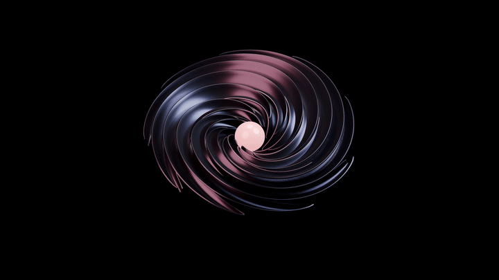
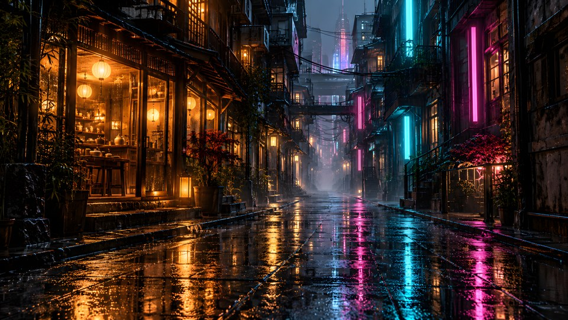
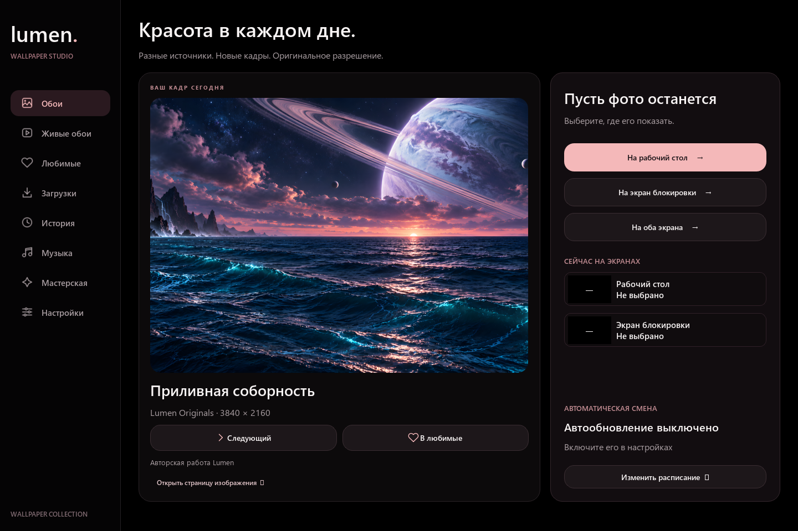

  

  <b>Соберите пространство, в которое хочется возвращаться.</b> 
  Кинематографичные фоны, мягкое движение и любимая музыка на вашем рабочем столе.

  
  &nbsp;
  

  <b>Бесплатно</b> &nbsp; · &nbsp; Windows 10 / 11 x64 &nbsp; · &nbsp; Версия 0.1.0 
  <a href="https://github.com/Thenden728/Lumen-Releases/releases/latest">Что нового</a> &nbsp; / &nbsp;
  <a href="#ваш-экран-ваши-правила">Возможности</a> &nbsp; / &nbsp;
  <a href="#частые-вопросы">Вопросы</a> &nbsp; / &nbsp;
  <a href="https://github.com/Thenden728/Lumen-Releases/issues">Поддержка</a>

---

## Чёрный фон. Живой свет.

Металлический цветок медленно раскрывает розовые блики. Ночной город растворяется в неоне. Над далёким океаном поднимается планета с кольцами. Выберите настроение — Lumen поселит его на вашем экране.

   
  «Чёрный ирис» · Lumen Originals · фрагмент реальной анимации, уменьшенный для GitHub.

<table>
  <tr>
    <td width="50%"> <b>Другие миры</b> Масштаб, свет и пространство.</td>
    <td width="50%"> <b>После полуночи</b> Неон, дождь и тихий вечер.</td>
  </tr>
</table>

Авторские работы из коллекции Lumen. Изображения показывают оформление; параметры анимации зависят от выбранной работы.

## Ваш экран, ваши правила

| Для настроения | Для удобства |
| :--- | :--- |
| **Фото и живые обои** — от спокойного кадра до анимированного мира. | **Несколько источников** — поиск, жанры и выбор качества в одном приложении. |
| **Lumen Originals** — собственная коллекция с атмосферными работами. | **Любимые и папки** — сохраняйте находки и собирайте личные подборки. |
| **Музыка рядом** — прозрачный виджет с обложкой и управлением треками. | **Загрузки и история** — возвращайтесь к увиденному и управляйте файлами. |
| **Чёрный интерфейс** — мягкие розовые акценты, округлые панели, внимание к фону. | **Автоматическая смена** — расписание, каталоги или только ваши любимые. |

### Красота в каждом дне

Новый кадр для рабочего стола, отдельное фото для экрана блокировки. Всё нужное для выбора и установки — рядом.

### Найдите своё движение

Подбирайте живые обои, смотрите их перед установкой, сохраняйте в любимые и выбирайте доступное качество. Можно использовать собственный видеофайл.

### Саундтрек вашего пространства

Лёгкая панель с обложкой, переключением треков, воспроизведением и громкостью выбранного приложения. Прозрачность и компактный вид помогают вписать её в ваш рабочий стол.

   
  Реальные элементы интерфейса. Скриншоты сняты с демонстрационными данными; музыкальные функции зависят от возможностей приложения-источника.

---

## Три шага до вашего настроения

1. **[Скачайте установщик](https://github.com/Thenden728/Lumen-Releases/releases/download/v0.1.0/Lumen-Setup-0.1.0-x64.exe).** Нужен только файл `Lumen-Setup-0.1.0-x64.exe`.
2. **Установите Lumen.** Мастер на русском и английском, установка для вашего пользователя.
3. **Откройте Lumen из «Пуска».** Выберите фото или живые обои; добавьте музыку и расписание по желанию.

Python и Blender устанавливать не нужно. Автозапуск и автоматическая смена включаются по вашему выбору.

**[Подробная инструкция →](docs/START.md)**

## Частые вопросы

<b>Это бесплатно?</b>

Да. Lumen можно бесплатно использовать в личных и коммерческих целях. Права на обои сторонних авторов регулируются отдельно. [Условия использования](TERMS.txt).

<b>Как обновить приложение и сохранить коллекцию?</b>

Закройте Lumen и запустите установщик новой версии поверх прежней. Настройки и библиотека сохраняются. Предварительно удалять приложение не нужно.

<b>Какая Windows нужна? Есть ли ограничения?</b>

Windows 10 / 11 x64. Установка и функции релиза проверены в чистой Windows 11. Доступность каталогов, качество видео и поддержка музыкальных команд зависят от сервисов, приложений и оборудования. Живые обои устанавливаются на рабочий стол; для блокировки используются фотографии.

<b>Почему Windows может показать предупреждение при установке?</b>

Установщик пока не имеет цифровой подписи издателя. Скачивайте его с этой страницы релизов. Контрольные суммы опубликованы в `SHA256SUMS.txt`. Если защита блокирует файл, остановите установку и сообщите об этом через Issues.

<b>Нужны ли ключи сервисов? Что за архив исходников в релизе?</b>

Для источников, которым требуется авторизация, свои ключи можно указать в настройках Lumen. Архив `Lumen-Dependency-Sources-0.1.0.zip` содержит исходники сторонних библиотек и не нужен для установки. Лицензии зависимостей включены в дистрибутив. Этот репозиторий содержит публичные сборки и поддержку; исходники приложения разрабатываются отдельно.

<b>Как удалить Lumen?</b>

Через «Параметры → Приложения → Установленные приложения» Windows. Личные настройки и скачанные обои остаются на устройстве; управлять загрузками можно в самом Lumen.

---

  <b>Найдите свой свет.</b> 
  <a href="https://github.com/Thenden728/Lumen-Releases/releases/latest">Скачать Lumen</a> &nbsp; · &nbsp;
  <a href="https://github.com/Thenden728/Lumen-Releases/issues/new/choose">Сообщить об ошибке или предложить идею</a>  
  Lumen · Wallpaper Studio · Сделано для вашего пространства.

