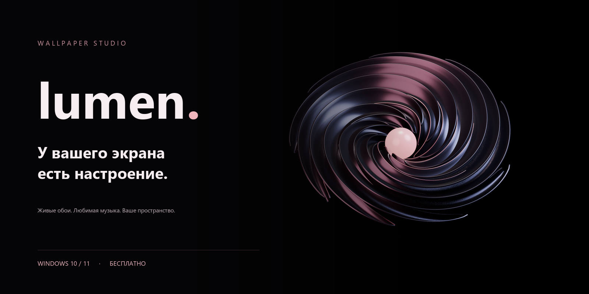
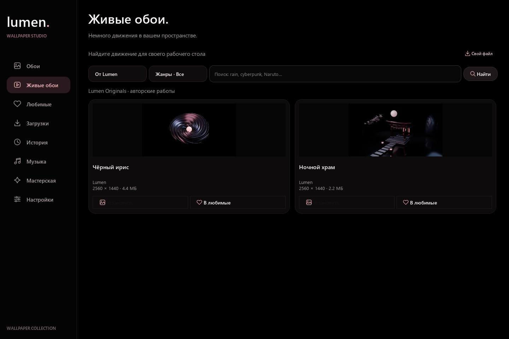
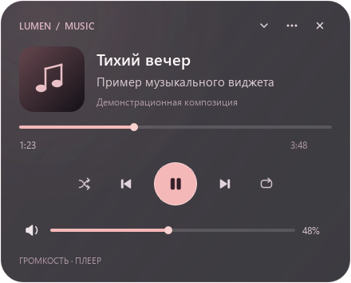

# Ваш первый вечер с Lumen

[← На главную](../README.md)

## 01 · Установите

**[Скачать Lumen для Windows x64](https://github.com/Thenden728/Lumen-Releases/releases/download/v0.1.0/Lumen-Setup-0.1.0-x64.exe)**

Запустите `Lumen-Setup-0.1.0-x64.exe`, выберите язык и пройдите мастер. Затем откройте **Lumen** в меню «Пуск». Дополнительные архивы из релиза для установки не нужны.

Приложение устанавливается для текущего пользователя. Python и Blender не нужны. Установщик пока без цифровой подписи издателя; файлы и контрольные суммы размещены на [официальной странице версии](https://github.com/Thenden728/Lumen-Releases/releases/latest).

## 02 · Выберите настроение

| Хочется… | Откройте |
| :--- | :--- |
| Красивое фото | **Обои** — выберите кадр и экран: рабочий стол, блокировка или оба. |
| Движение и атмосферу | **Живые обои** — выберите источники и жанры, найдите работу, откройте карточку и предпросмотр. |
| Сохранить находку | **В любимые** — закладка сохраняется без обязательного скачивания. |
| Установить видео | В карточке выберите доступное качество, скачайте и установите. |
| Вернуться к файлам | **Загрузки** — скачанные обои и текущие загрузки. |
| Вернуться к прошлому кадру | **История**. |

Доступность предпросмотра и вариантов качества зависит от источника. Внешние сервисы могут требовать ключ или быть временно недоступны. Свои ключи вводите только в настройках приложения.

## 03 · Добавьте музыку

Запустите музыкальное приложение и начните воспроизведение. В Lumen откройте **Музыка**, включите виджет и выберите источник автоматически или вручную. Настройте прозрачность и удобный размер панели.

Поддержка обложек, переключения, перемотки и громкости зависит от того, какие команды предоставляет выбранное приложение через Windows.

## 04 · Пусть настроение меняется само

В **Настройках** выберите период и тип автоматической смены. Можно подбирать новые обои из каталогов или переключаться только между любимыми. Автозапуск и расписание включаются по вашему выбору.

## Обновление

Закройте Lumen, включая виджет и живые обои, и установите новую версию поверх старой. Коллекция и настройки сохраняются. Используйте ярлык **Lumen** из «Пуска».

## Нужна помощь?

**[Сообщить о проблеме →](https://github.com/Thenden728/Lumen-Releases/issues/new/choose)**

Укажите версию Lumen и Windows, ваши действия и ожидаемый результат. Прикрепите скриншот, если он помогает объяснить проблему. Не публикуйте ключи сервисов и личные данные.
